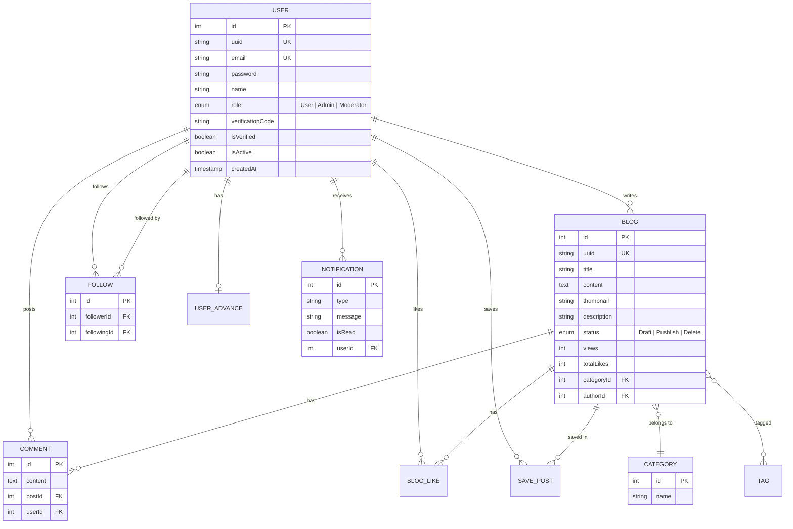

<p align="center">
  
</p>

<h1 align="center">Foxtek Blog — Backend API</h1>

<p align="center">
  <strong>RESTful API cho nền tảng blog cộng đồng, xây dựng với NestJS</strong>
</p>

<p align="center">
  
  
  
  
  
  
</p>

---

## 📋 Mục lục

- [Giới thiệu](#-giới-thiệu)
- [Kiến trúc hệ thống](#-kiến-trúc-hệ-thống)
- [Tech Stack](#-tech-stack)
- [Tính năng](#-tính-năng)
- [Database Schema](#-database-schema)
- [API Endpoints](#-api-endpoints)
- [Cấu trúc thư mục](#-cấu-trúc-thư-mục)
- [Cài đặt & Chạy](#-cài-đặt--chạy)
- [Biến môi trường](#-biến-môi-trường)
- [Tài liệu & Monitoring](#-tài-liệu--monitoring)

---

## 🎯 Giới thiệu

**Foxtek Blog Backend** là server API cung cấp toàn bộ nghiệp vụ cho nền tảng blog cộng đồng dành cho developer. Hệ thống được thiết kế theo kiến trúc **modular** của NestJS, tích hợp đầy đủ các tính năng từ xác thực người dùng, quản lý nội dung, tương tác xã hội đến thông báo thời gian thực.

**Frontend tương ứng:** [blog_fe](https://github.com/LeeMinhKhoaa/blog_fe) — Next.js 16 + React 19

---

## 🏗 Kiến trúc hệ thống

```
┌─────────────┐     ┌─────────────────────────────────────────────────┐
│   Frontend   │────▶│              NestJS Backend                     │
│  (Next.js)   │◀────│                                                 │
└─────────────┘     │  ┌──────────┐  ┌──────────┐  ┌──────────────┐  │
      │             │  │  Guards   │  │  Pipes   │  │ Interceptors │  │
      │ WebSocket   │  │ (Auth,   │  │(Validate)│  │  (Response   │  │
      │             │  │  Role,   │  │          │  │   Transform) │  │
      │             │  │ Verified)│  └──────────┘  └──────────────┘  │
      │             │  └──────────┘                                   │
      │             │                                                 │
      │             │  ┌─────────────────────────────────────────┐    │
      │             │  │            Service Layer                 │    │
      │             │  │  Auth │ Blog │ User │ Comment │ Notify   │    │
      │             │  └────────────┬────────────────────────────┘    │
      │             │               │                                 │
      │             │  ┌────────────▼────────────┐                    │
      │             │  │    TypeORM Repository    │                    │
      │             │  └────────────┬────────────┘                    │
      │             └───────────────┼─────────────────────────────────┘
      │                             │
      ▼                             ▼
┌──────────┐              ┌──────────────┐     ┌──────────┐
│Socket.io │              │   MySQL 8    │     │  Redis   │
│ Gateway  │              │  (TypeORM)   │     │ Cache +  │
└──────────┘              └──────────────┘     │ BullMQ   │
                                               └──────────┘
```

**Luồng xử lý request:**
1. Client gửi request → **Guard** kiểm tra auth & role
2. **Pipe** validate input (DTO + class-validator)
3. **Controller** điều hướng đến **Service**
4. Service xử lý logic, truy vấn DB qua **Repository**
5. **Interceptor** chuẩn hóa response format
6. **Exception Filter** bắt & format lỗi thống nhất

---

## ⚡ Tech Stack

| Lớp | Công nghệ | Mục đích |
|---|---|---|
| **Framework** | NestJS 11 | Backend framework với Dependency Injection, modular architecture |
| **Language** | TypeScript 5 | Type safety, IntelliSense, dễ bảo trì |
| **Database** | MySQL 8 + TypeORM | Relational DB, ORM với migration & entity mapping |
| **Caching** | Redis + cache-manager | Cache hot data, session, giảm tải DB |
| **Queue** | BullMQ + Bull Board | Background jobs (gửi mail), monitoring UI |
| **Real-time** | Socket.io | Thông báo tức thời (follow, like, comment) |
| **Auth** | JWT + bcrypt | Access Token (15m) + Refresh Token (7d), HttpOnly Cookie |
| **Mail** | Nodemailer + Handlebars | Email verification, OTP templates |
| **Validation** | class-validator + class-transformer | DTO validation, data transformation |
| **Security** | Throttler + Helmet | Rate limiting, HTTP security headers |
| **API Docs** | Swagger / OpenAPI | Tài liệu API tự động tại `/api` |
| **Container** | Docker + Docker Compose | MySQL + Redis + Backend + Frontend trong 1 lệnh |

---

## ✨ Tính năng

### 🔐 Authentication & Authorization
| Feature | Chi tiết |
|---|---|
| Đăng ký / Đăng nhập | Bcrypt hash, JWT HttpOnly Cookie |
| Silent Refresh | Auto refresh khi Access Token hết hạn, Rotation strategy |
| Email Verification | OTP 6 số qua email, Resend với rate limit |
| Role-based Access | 3 vai trò: `User` · `Moderator` · `Admin` |
| Verified Guard | Một số action yêu cầu tài khoản đã xác thực email |

### 📝 Blog Management
| Feature | Chi tiết |
|---|---|
| CRUD bài viết | Tạo, sửa, xóa (soft delete), phân quyền theo author |
| Rich Content | Lưu trữ HTML từ TipTap editor (headings, images, youtube, code) |
| Categories & Tags | Phân loại bài viết, many-to-many relationship |
| Trending | Xếp hạng bài viết theo lượt xem, cache bằng Redis |
| Pagination | Cursor-based pagination với filter & search |
| View Tracking | Đếm lượt xem real-time |

### 👥 Social Interaction
| Feature | Chi tiết |
|---|---|
| Like / Unlike | Toggle like bài viết, đếm totalLikes |
| Save / Unsave | Lưu bài viết vào bookmark cá nhân |
| Follow System | Theo dõi tác giả, xem danh sách following/followers |
| Comments | Bình luận bài viết, like comment |
| Public Profile | Xem thông tin & bài viết của user khác |

### 🔔 Real-time & Background Jobs
| Feature | Chi tiết |
|---|---|
| Socket.io Notifications | Thông báo instant khi follow, like, comment |
| Email Queue (BullMQ) | Gửi mail OTP, welcome email qua background job |
| Bull Board Dashboard | UI monitoring trạng thái queue tại `/admin/queues` |

### ⚙️ System Design
| Pattern | Chi tiết |
|---|---|
| Global Response Interceptor | Chuẩn hóa `{ statusCode, message, data }` cho mọi response |
| Global Exception Filter | Xử lý lỗi tập trung, format error response thống nhất |
| Custom Decorators | `@CurrentUser()`, `@Public()`, `@Roles()`, `@RequireVerified()` |
| Base Entity | `createdAt`, `updatedAt`, `createdBy`, `updatedBy` tự động |
| Audit Trail | Ghi nhận user tạo/cập nhật data qua subscriber |

---

## 🗄 Database Schema



---

## 🛣 API Endpoints

### Auth (`/auth`)
| Method | Endpoint | Mô tả | Auth |
|---|---|---|---|
| `POST` | `/auth/sign-up` | Đăng ký tài khoản | ❌ Public |
| `POST` | `/auth/sign-in` | Đăng nhập | ❌ Public |
| `POST` | `/auth/logout` | Đăng xuất (xóa cookie) | ✅ Required |
| `POST` | `/auth/refresh` | Silent token refresh | ❌ Public |
| `POST` | `/auth/verify-email` | Xác thực OTP email | ❌ Public |
| `POST` | `/auth/resend-verification` | Gửi lại mã OTP | ❌ Public |
| `GET` | `/auth/me` | Lấy thông tin user hiện tại | ✅ Required |

### Blogs (`/blogs`)
| Method | Endpoint | Mô tả | Auth |
|---|---|---|---|
| `GET` | `/blogs` | Danh sách bài viết (pagination, search, filter) | ❌ Public |
| `GET` | `/blogs/:id` | Chi tiết bài viết | ❌ Public |
| `POST` | `/blogs` | Tạo bài viết mới | ✅ Admin/Mod |
| `PUT` | `/blogs/:id` | Cập nhật bài viết | ✅ Required |
| `DELETE` | `/blogs/:id` | Xóa bài viết | ✅ Admin |
| `GET` | `/blogs/trending` | Bài viết trending | ❌ Public |
| `GET` | `/blogs/categories` | Danh sách categories | ❌ Public |
| `GET` | `/blogs/my-blogs` | Bài viết của tôi | ✅ Required |
| `POST` | `/blogs/:id/view` | Tăng lượt xem | ❌ Public |
| `POST` | `/blogs/like-blog` | Like/Unlike bài viết | ✅ Required |
| `POST` | `/blogs/saved-blog` | Lưu/Bỏ lưu bài viết | ✅ Required |
| `GET` | `/blogs/saved-blogs` | Danh sách bài đã lưu | ✅ Required |

### Users (`/users`)
| Method | Endpoint | Mô tả | Auth |
|---|---|---|---|
| `GET` | `/users/profile/:id` | Xem profile công khai | ❌ Public |
| `PUT` | `/users/profile` | Cập nhật profile | ✅ Required |
| `POST` | `/users/follow/:id` | Follow/Unfollow | ✅ Required |

### Comments (`/comments`)
| Method | Endpoint | Mô tả | Auth |
|---|---|---|---|
| `GET` | `/comments/post/:postId` | Lấy comments theo bài viết | ❌ Public |
| `POST` | `/comments` | Tạo comment mới | ✅ Required |
| `DELETE` | `/comments/:id` | Xóa comment | ✅ Required |

### Notifications (`/notifications`)
| Method | Endpoint | Mô tả | Auth |
|---|---|---|---|
| `GET` | `/notifications` | Danh sách thông báo | ✅ Required |
| `PATCH` | `/notifications/:id/read` | Đánh dấu đã đọc | ✅ Required |

---

## 📂 Cấu trúc thư mục

```
src/
├── main.ts                          # Bootstrap, CORS, Swagger, Cookie
├── app.module.ts                    # Root module, TypeORM config
│
├── common/                          # Shared utilities
│   ├── base/                        # BaseEntity (audit fields)
│   ├── decorators/                  # @CurrentUser, @Public, @Roles, @RequireVerified
│   ├── dto/                         # Shared DTOs
│   ├── exceptions/                  # Custom exceptions
│   ├── filters/                     # Global exception filter
│   ├── guards/                      # AuthGuard, RolesGuard, VerifiedGuard
│   ├── interceptors/                # Response transform interceptor
│   ├── helper/                      # Pagination helper
│   ├── logger/                      # Custom logger
│   ├── services/                    # Shared services
│   └── subscribers/                 # TypeORM audit subscriber
│
├── modules/
│   ├── auth/                        # JWT login, register, refresh, verify email
│   │   ├── auth.controller.ts
│   │   ├── auth.service.ts
│   │   └── dto/
│   │
│   ├── users/                       # Profile, follow system
│   │   ├── entity/
│   │   │   ├── user.entity.ts       # User + Role enum
│   │   │   ├── user-advance.entity.ts  # Avatar, bio
│   │   │   └── follow.entity.ts     # Follow relationship
│   │   ├── users.service.ts
│   │   └── user.controller.ts
│   │
│   ├── blog/                        # Blog CRUD, like, save, trending
│   │   ├── entity/
│   │   │   ├── blog.entity.ts       # Blog + Status enum
│   │   │   ├── category.entity.ts
│   │   │   ├── tag.entity.ts
│   │   │   ├── blog-like.entity.ts
│   │   │   └── save-post.entity.ts
│   │   ├── blog.service.ts
│   │   ├── blog-interaction.service.ts
│   │   └── blog.controller.ts
│   │
│   ├── comments/                    # Comment CRUD, like comment
│   ├── notifications/               # Socket.io gateway + notification service
│   ├── mail/                        # Email templates (Handlebars) + BullMQ queue
│   ├── files/                       # File upload (image)
│   ├── cache/                       # Redis cache service
│   ├── redis/                       # Redis connection module
│   └── admin/                       # Admin dashboard API
│
└── db/                              # Database seeds, migrations
```

---

## 🚀 Cài đặt & Chạy

### Yêu cầu
- **Node.js** >= 20
- **MySQL** 8
- **Redis** >= 6
- **pnpm** (hoặc npm)

### Cách 1: Docker Compose (Khuyên dùng)

```bash
# Clone repository
git clone https://github.com/LeeMinKaHo/blog-be.git
cd blog-be

# Tạo file .env (xem mục Biến môi trường bên dưới)
cp .env.example .env

# Khởi chạy toàn bộ stack (MySQL + Redis + Backend + Frontend)
docker-compose up --build
```

### Cách 2: Chạy local

```bash
# 1. Clone & cài dependencies
git clone https://github.com/LeeMinKaHo/blog-be.git
cd blog-be
npm install

# 2. Cấu hình .env (đảm bảo MySQL & Redis đang chạy)
cp .env.example .env

# 3. Chạy development server
npm run start:dev
```

Server sẽ khởi động tại `http://localhost:3000`

---

## 🔑 Biến môi trường

```env
# Database
DATABASE_HOST=localhost
DATABASE_PORT=3306
DATABASE_USER=root
DATABASE_PASSWORD=your_password
DATABASE_NAME=foxtek_blog

# Redis
REDIS_HOST=localhost
REDIS_PORT=6379

# JWT
JWT_SECRET=your_jwt_secret_key
JWT_EXPIRES_IN=15m

# Mail (Gmail SMTP)
MAIL_USER=your_email@gmail.com
MAIL_PASS=your_app_password

# Application
SITE_URL=http://localhost:3000
FRONTEND_URL=http://localhost:3001
NODE_ENV=development
```

---

## 📖 Tài liệu & Monitoring

| Công cụ | URL | Mô tả |
|---|---|---|
| **Swagger UI** | `http://localhost:3000/api` | Tài liệu API tương tác, test trực tiếp |
| **Bull Board** | `http://localhost:3000/admin/queues` | Dashboard monitoring background jobs |

---

## 🧩 Design Decisions

| Quyết định | Lý do |
|---|---|
| **JWT trong HttpOnly Cookie** | Bảo mật hơn localStorage, tránh XSS attack |
| **Refresh Token Rotation** | Mỗi lần refresh đều cấp token mới, giảm rủi ro token bị đánh cắp |
| **BullMQ cho Email** | Tách mail khỏi request flow, retry khi fail, không block response |
| **TypeORM Entity Subscriber** | Tự động audit `createdBy`/`updatedBy`, tách logic khỏi service |
| **Global Response Interceptor** | Đảm bảo mọi API trả về format nhất quán `{ statusCode, message, data }` |
| **Modular Architecture** | Mỗi feature là 1 module độc lập, dễ scale và maintain |

---

## 📜 Quy ước phát triển

- Sử dụng **DTO + class-validator** cho mọi input validation
- Custom decorators thay vì lặp logic: `@CurrentUser()`, `@Public()`, `@Roles()`
- Background jobs (email, heavy tasks) phải đẩy vào **BullMQ**
- Entity relationship qua **TypeORM decorators**, không viết raw SQL
- Response format chuẩn qua **Global Interceptor**, không format thủ công

---

<p align="center">
  <sub>Built with ❤️ by <strong>Foxtek Team</strong> — Backend engine powering the Foxtek Blog Community</sub>
</p>
